# Behavior Snapshot — Riigikogu Mobile Dashboard (pre-rebuild baseline)

> **What this is.** An automated characterization of the deployed app exactly as it
> behaves today, captured before any of the rebuild work in `ARCHITECTURE_PLAN.md`
> begins. It is the reference the Phase-2 Usability Contract is written against and
> the document Phase 4 must reproduce 1:1 in behavior.
>
> **Everything below was measured, not read off the source.** The app is a minified
> bundle; every number, colour, and label here came out of a real Chromium session
> driving the real page.

| | |
|---|---|
| **Captured** | 2026-08-11 |
| **Commit** | `291ba1e` (default branch `claude/setup-pwa-structure-R7z8d`) |
| **Rollback ref** | `v-stable-pre-rebuild` |
| **Method** | Playwright 1.5x + pre-installed Chromium 1194, `/opt/pw-browsers/chromium` |
| **Served by** | `python3 -m http.server 8099` from repo root |
| **Viewport** | 390 × 844, DPR 2 (iPhone-class portrait) |
| **Screenshots** | `snapshot/` — 19 PNGs, referenced inline below |

---

## 1. App shell

| Element | Value |
|---|---|
| `<title>` | `XV Riigikogu Dashboard` |
| Header line 1 | **XV Riigikogu** |
| Header line 2 | `Estonian Parliament • 101 MPs • Jan 2026` |
| Navigation | Fixed bottom bar, 3 tabs, no URL routing (tab state is in memory only) |
| Active-tab colour | `rgb(147, 51, 234)` (purple-600); inactive `rgb(148, 163, 184)` (slate-400) |

The header's **"Jan 2026"** is the app's own staleness label and is the single most
useful thing in the UI for §8 below.

### Tab names (exact strings)

1. `Parliament`
2. `Members`
3. `Calculator`

---

## 2. Tab 1 — Parliament

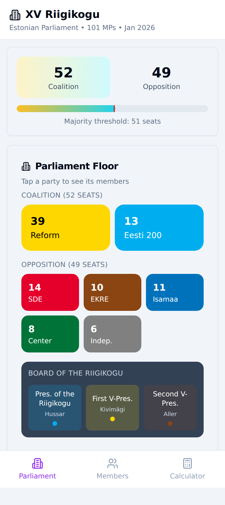

### Displayed seat totals

| Readout | Value |
|---|---|
| Coalition (big number) | **52** |
| Opposition (big number) | **49** |
| Progress bar caption | `Majority threshold: 51 seats` |
| Coalition section heading | `COALITION (52 SEATS)` |
| Opposition section heading | `OPPOSITION (49 SEATS)` |
| Section subtitle | `Parliament Floor` / `Tap a party to see its members` |

52 + 49 = 101. Note the app has **no third bucket**: the 6 MPs it labels
`Indep.` are counted inside the Opposition 49. That editorial choice is a
correctness problem as of 2026-08-10 — see §8.3.

### Party chips — names and rendered hex colours

Colours are `getComputedStyle().backgroundColor` on the chip and `.color` on its
label text, converted to hex. These are the authoritative values for
`data/parties.json` in Phase 1 — do not re-invent them.

| Party (as displayed) | Seats | Background | Text | Bloc |
|---|---|---|---|---|
| Reform | 39 | `#FFD700` `rgb(255,215,0)` | `#000000` | Coalition |
| Eesti 200 | 13 | `#00AEEF` `rgb(0,174,239)` | `#FFFFFF` | Coalition |
| SDE | 14 | `#E4002B` `rgb(228,0,43)` | `#FFFFFF` | Opposition |
| EKRE | 10 | `#8B4513` `rgb(139,69,19)` | `#FFFFFF` | Opposition |
| Isamaa | 11 | `#0072BC` `rgb(0,114,188)` | `#FFFFFF` | Opposition |
| Center | 8 | `#007438` `rgb(0,116,56)` | `#FFFFFF` | Opposition |
| Indep. | 6 | `#808080` `rgb(128,128,128)` | `#FFFFFF` | Opposition |

Reform is the only party with black label text. The Members tab and the
calculator spell the last one `Independent`; only the Parliament chip abbreviates
it to `Indep.` — both strings must survive the rebuild.

Coalition chips render larger (154×80 px) than opposition chips (100×64 px).

### Board of the Riigikogu

Three buttons in a dark panel headed `BOARD OF THE RIIGIKOGU`. Each is tinted with
its holder's party colour at 19% alpha.

| Label | Name shown | Tint |
|---|---|---|
| `Pres. of the Riigikogu` | Hussar | `rgba(0,174,239,0.19)` — Eesti 200 |
| `First V-Pres.` | Kivimägi | `rgba(255,215,0,0.19)` — Reform |
| `Second V-Pres.` | Aller | `rgba(139,69,19,0.19)` — EKRE |

Tapping one opens that MP's popup (§3.1).

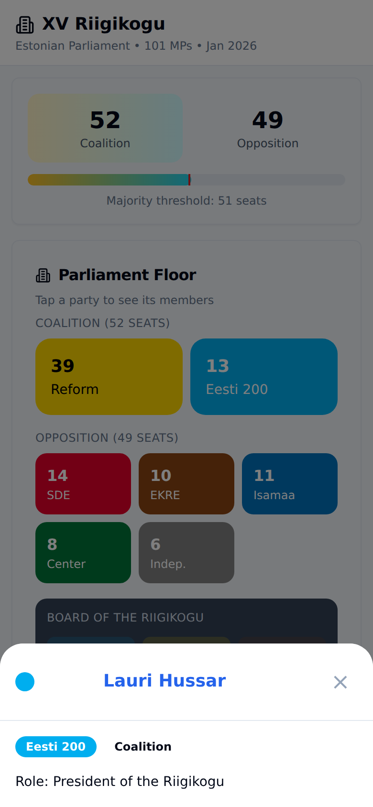

### Party sheet (tap a party chip)

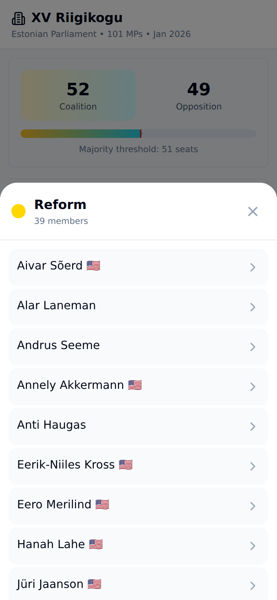

Opens a fixed overlay listing the party's members. Header is the party name plus
`39 members`; closes with a `×` button. Members carry inline role captions where
they hold one — observed on the Reform sheet: `Faction Chairman` (Õnne Pillak),
`Faction Deputy Chairman` (Mihkel Lees, Valdo Randpere),
`First Vice-President` (Toomas Kivimägi). MP names in the sheet are **not**
individually clickable.

---

## 3. Tab 2 — Members

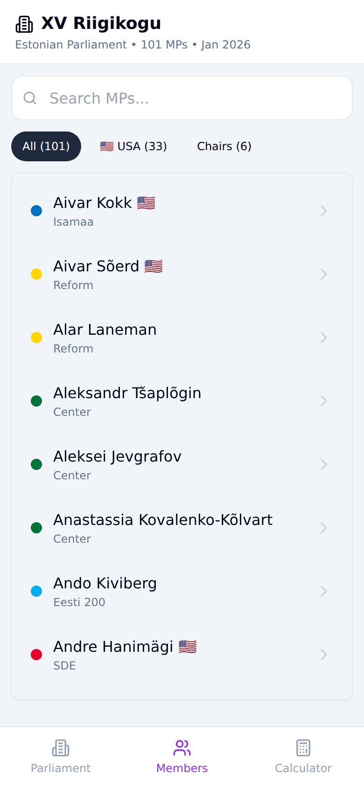

| Control | Detail |
|---|---|
| Search box | `<input placeholder="Search MPs...">`, filters live on keystroke |
| Filter chips | `All (101)` · `🇺🇸 USA (33)` · `Chairs (6)` |
| Active chip style | bg `rgb(30,41,59)`, text white; inactive bg `rgb(241,245,249)` |
| Rows | 101 buttons, alphabetical by first name, each = name + party-colour dot + party label + chevron |
| USA marker | 🇺🇸 suffix on the name for 33 MPs |

Search is a substring match on the full name — typing `Kall` returns
Juku-**Kall**e Raid, **Kall**e Grünthal, **Kall**e Laanet, Madis **Kall**as (4 rows).

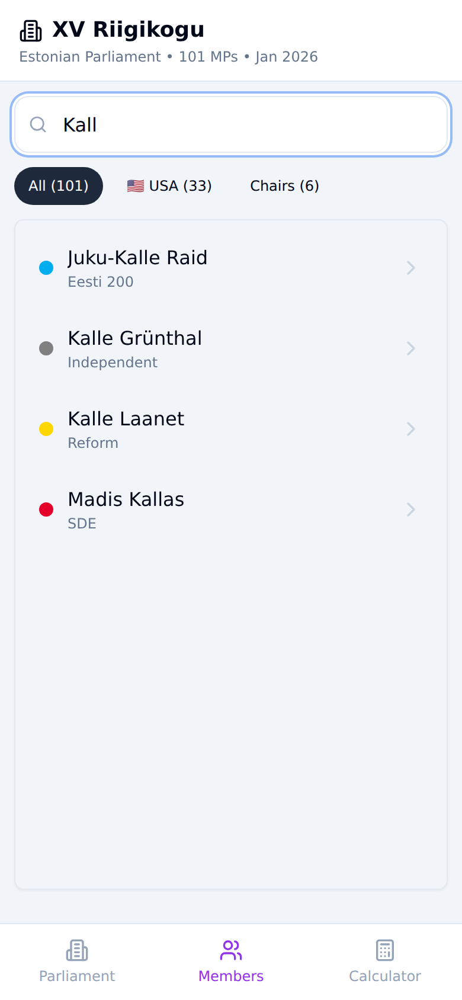
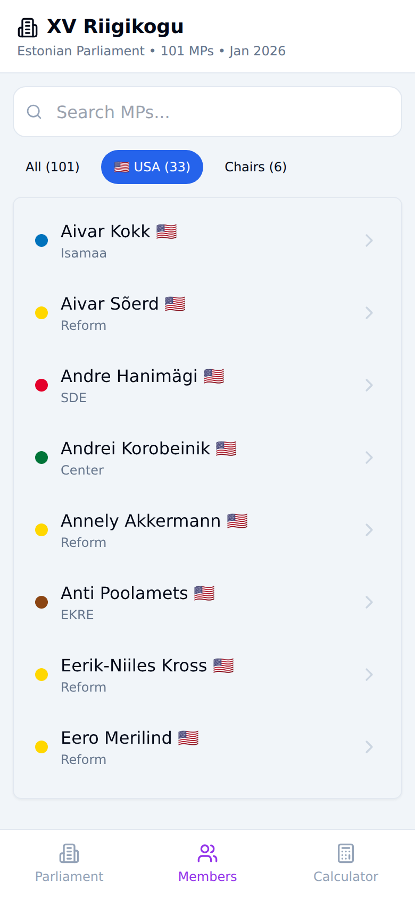

`Chairs (6)` yields exactly the six faction chairmen:

| MP | Party |
|---|---|
| Helir-Valdor Seeder | Isamaa |
| Lauri Läänemets | SDE |
| Lauri Laats 🇺🇸 | Center |
| Martin Helme | EKRE |
| Õnne Pillak | Reform |
| Toomas Uibo | Eesti 200 |

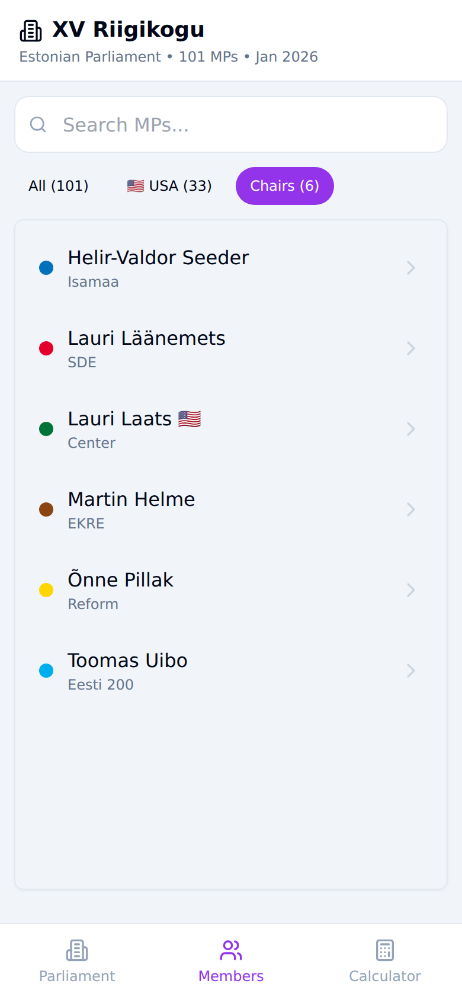

### 3.1 MP popup

Tapping any MP row opens a bottom sheet.

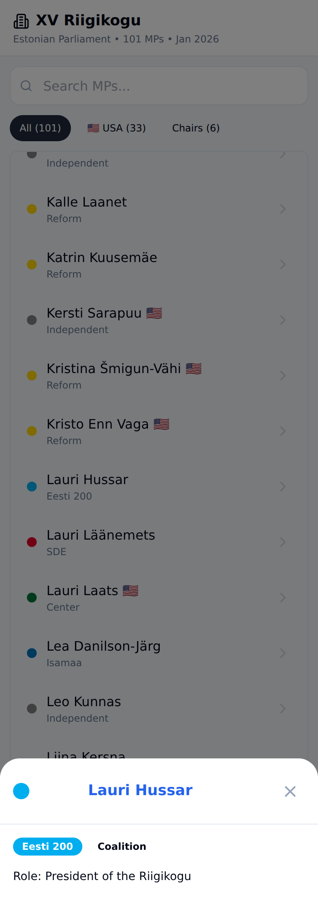
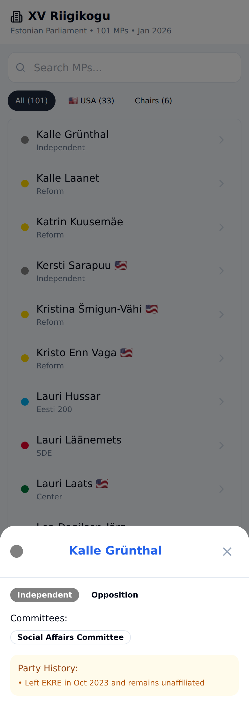

Contents, in order:

1. Circular photo (`` from `riigikogu.ee/wpcms/.../temp/small_<uuid>.jpg`),
   falling back to a party-coloured disc.
2. **MP name as an external link** — `target="_blank"`, e.g.
   `https://www.riigikogu.ee/en/parliament-of-estonia/composition/members-riigikogu/saadik/64c0141f-371b-4520-8a50-09e65231f775/Lauri-Hussar`
3. `×` close button.
4. Party badge in the party colour, plus a `Coalition` / `Opposition` label.
5. `Role:` line when the MP holds one (`Role: President of the Riigikogu`).
6. `Committees:` list of pill chips (`Social Affairs Committee`).
7. `Party History:` amber panel for defectors —
   `• Left EKRE in Oct 2023 and remains unaffiliated`.

Sections 5–7 render only when the MP has that data.

---

## 4. Tab 3 — Calculator

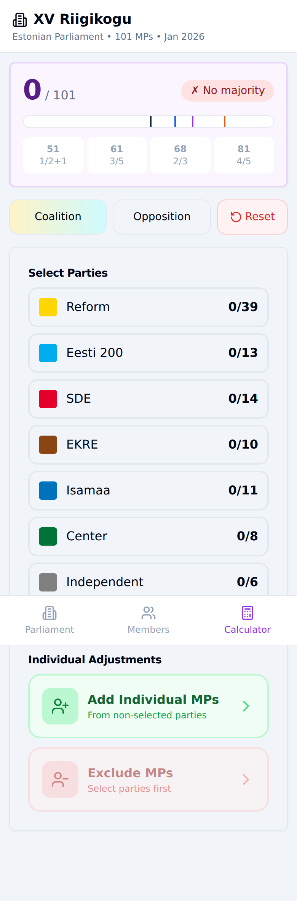

### Readout

| Element | Empty state |
|---|---|
| Total | `0/ 101` |
| Verdict | `✗ No majority` |
| Threshold cards | `51` (`1/2+1`), `61` (`3/5`), `68` (`2/3`), `81` (`4/5`) |

A threshold card lights up when the selection reaches it:

| Threshold | Inactive | Active background |
|---|---|---|
| 51 | `rgb(255,255,255)` | `rgb(220,252,231)` green |
| 61 | `rgb(255,255,255)` | `rgb(219,234,254)` blue |
| 68 | `rgb(255,255,255)` | `rgb(243,232,255)` purple |
| 81 | `rgb(255,255,255)` | — (not reached in any scenario below) |

The verdict flips to `✓ Majority` at ≥ 51.

### Controls

| Control | Behavior |
|---|---|
| `Coalition` | Selects Reform + Eesti 200 |
| `Opposition` | Selects SDE + EKRE + Isamaa + Center + Independent |
| `Reset` | Clears selection and all individual adjustments |
| 7 party rows | Toggle whole party; label shows `selected/total`, e.g. `Reform 0/39` |
| `Add Individual MPs` | Subtitle `From non-selected parties` |
| `Exclude MPs` | Subtitle `Select parties first` → `From selected parties` once a party is on |

### 4.1 Three recorded scenarios

**S1 — Coalition preset**

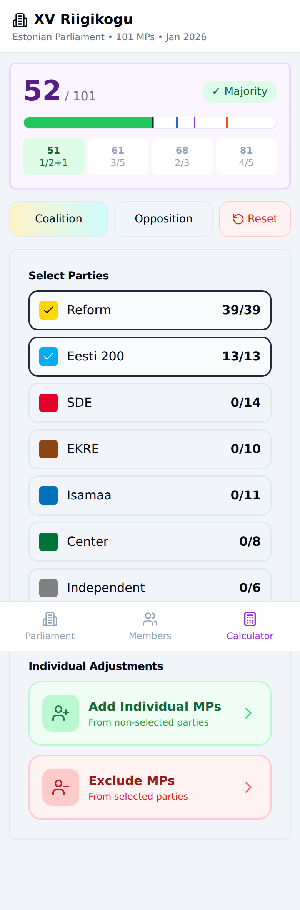

| Step | Total | Verdict | Thresholds met |
|---|---|---|---|
| tap `Coalition` | **52 / 101** | ✓ Majority | 51 |

Party rows read `Reform 39/39`, `Eesti 200 13/13`, all others `0/n`.

**S2 — Opposition preset**

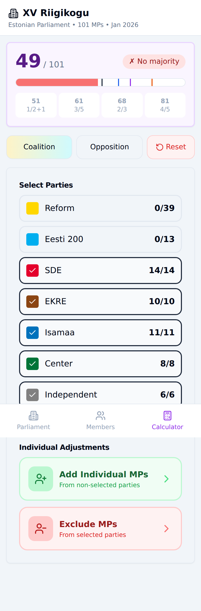

| Step | Total | Verdict | Thresholds met |
|---|---|---|---|
| tap `Opposition` | **49 / 101** | ✗ No majority | — |

Party rows read `SDE 14/14`, `EKRE 10/10`, `Isamaa 11/11`, `Center 8/8`,
`Independent 6/6`.

**S3 — Four parties, then one exclusion and one addition**

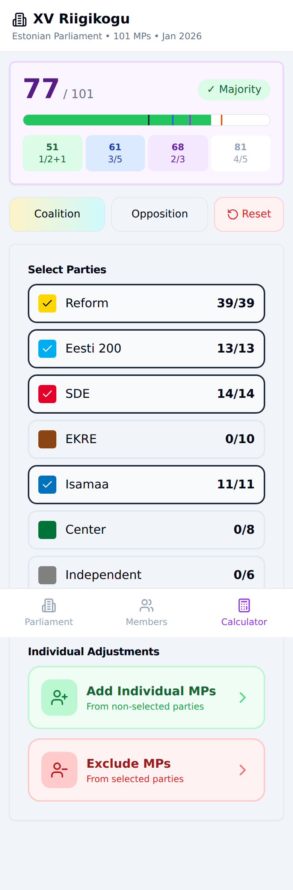

| Step | Total | Verdict | Thresholds met |
|---|---|---|---|
| select Reform | 39 / 101 | ✗ No majority | — |
| + Eesti 200 | 52 / 101 | ✓ Majority | 51 |
| + Isamaa | 63 / 101 | ✓ Majority | 51, 61 |
| + SDE | **77 / 101** | ✓ Majority | 51, 61, 68 |
| exclude Aivar Sõerd (Reform) | **76 / 101** | ✓ Majority | 51, 61, 68 |
| add Anti Poolamets (EKRE) | **77 / 101** | ✓ Majority | 51, 61, 68 |

Each step's delta equals exactly the seat count the app itself displays for that
party — the property the Tier-1 self-consistency tests rely on.

### 4.2 Individual-adjustment semantics (measured)

- **Exclude** subtracts **1** from the total and decrements that party's row to
  `38/39`, with a red `-1` badge next to it and a `1 Sõerd` chip under
  *Individual Adjustments*.
- **Add** adds **1** to the total.
- The exclude picker lists **only selected** parties (`39 available to exclude`);
  the add picker lists **only non-selected** parties (`10 available to add`).
- Both are two-step: pick a party, then pick an MP. Both are modal overlays with
  their own `×`; selecting an MP does not auto-close them.

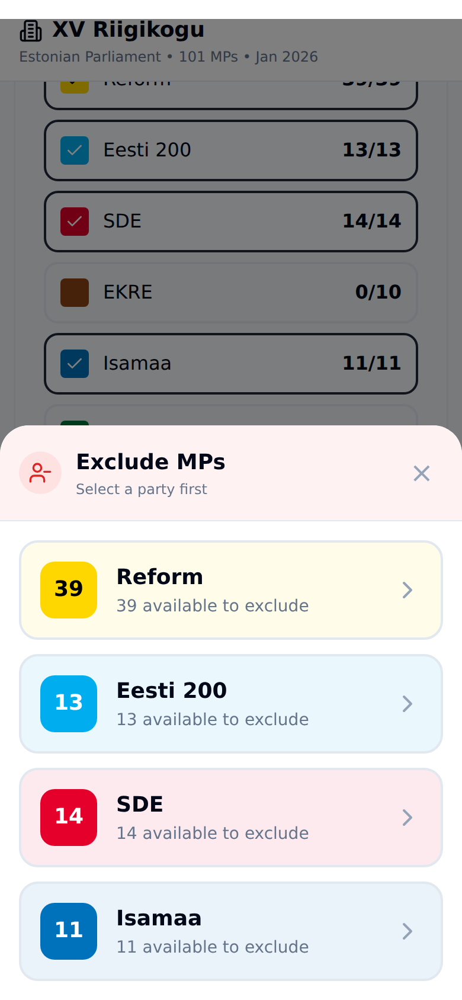
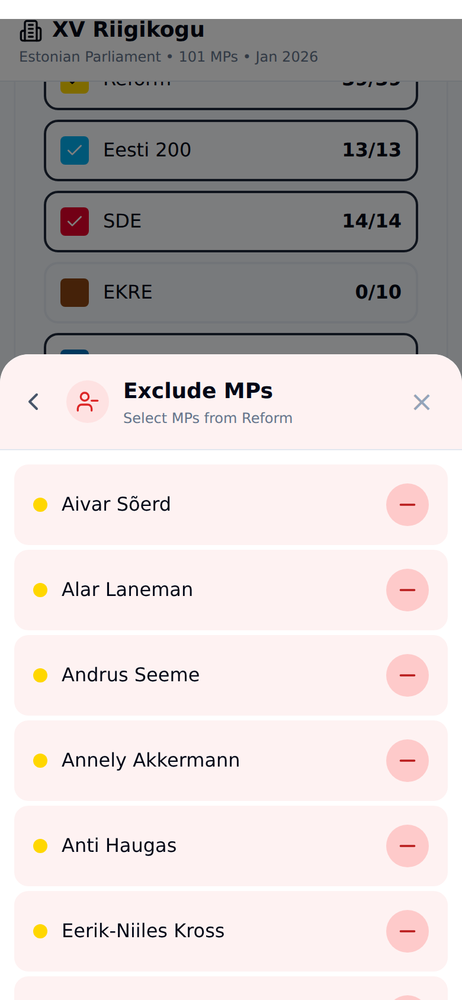
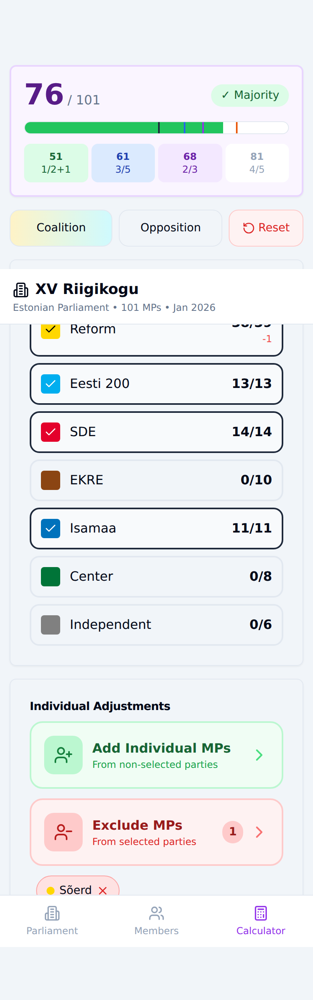
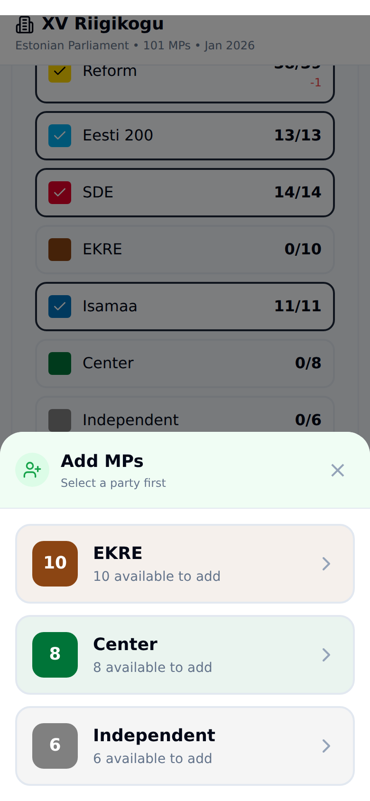
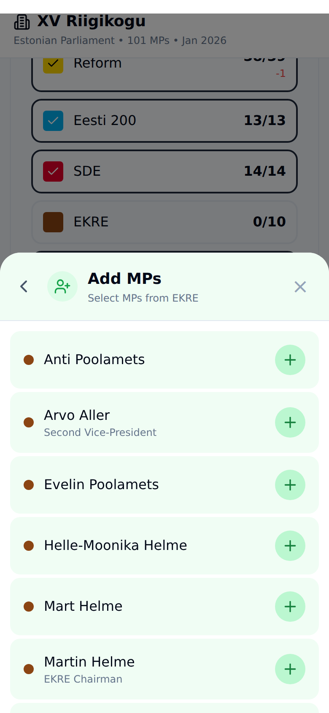
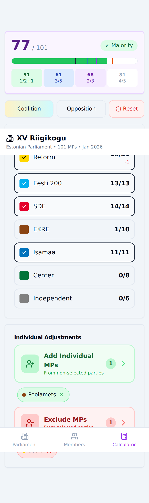

---

## 5. Complete clickable inventory

### Parliament (13)

7 party chips (`39 Reform`, `13 Eesti 200`, `14 SDE`, `10 EKRE`, `11 Isamaa`,
`8 Center`, `6 Indep.`) · 3 board buttons (`Pres. of the Riigikogu Hussar`,
`First V-Pres. Kivimägi`, `Second V-Pres. Aller`) · 3 tab buttons.

*Party sheet adds:* 1 `×`.

### Members (108)

1 search input · 3 filter chips (`All (101)`, `🇺🇸 USA (33)`, `Chairs (6)`) ·
101 MP rows · 3 tab buttons.

*MP popup adds:* 1 external profile link (`target="_blank"`) + 1 `×`.

### Calculator (15)

3 preset buttons (`Coalition`, `Opposition`, `Reset`) · 7 party toggles ·
`Add Individual MPs` · `Exclude MPs` · 3 tab buttons.

*Modals add:* one row per eligible party, one row per eligible MP, and a `×`.

---

## 6. Party colours — consolidated

```
Reform      #FFD700  text #000000
Eesti 200   #00AEEF  text #FFFFFF
SDE         #E4002B  text #FFFFFF
EKRE        #8B4513  text #FFFFFF
Isamaa      #0072BC  text #FFFFFF
Center      #007438  text #FFFFFF
Independent #808080  text #FFFFFF
```

These match the values recorded in `ARCHITECTURE_PLAN.md` finding 3 — confirmed
independently here from computed styles.

---

## 7. Roster as displayed (101 MPs)

App party = the **voting-bloc** assignment the app shows. API registered group =
what `GET /api/plenary-members?lang=EN` reported on 2026-08-11. Rows where the two
differ are defectors, not errors — see §8.

| # | MP (as displayed) | 🇺🇸 | App party (voting bloc) | API registered group |
|---|---|---|---|---|
| 1 | Aivar Kokk | 🇺🇸 | Isamaa | Isamaa |
| 2 | Aivar Sõerd | 🇺🇸 | Reform | Reform |
| 3 | Alar Laneman |  | Reform | Non-affiliated |
| 4 | Aleksandr Tšaplõgin |  | Center | Center |
| 5 | Aleksei Jevgrafov |  | Center | Center |
| 6 | Anastassia Kovalenko-Kõlvart |  | Center | Center |
| 7 | Ando Kiviberg |  | Eesti 200 | Eesti 200 |
| 8 | Andre Hanimägi | 🇺🇸 | SDE | Non-affiliated |
| 9 | Andrei Korobeinik | 🇺🇸 | Center | Center |
| 10 | Andres Metsoja |  | Isamaa | Isamaa |
| 11 | Andrus Seeme |  | Reform | Reform |
| 12 | Annely Akkermann | 🇺🇸 | Reform | Reform |
| 13 | Anti Allas |  | SDE | SDE |
| 14 | Anti Haugas |  | Reform | Reform |
| 15 | Anti Poolamets | 🇺🇸 | EKRE | EKRE |
| 16 | Ants Frosch |  | Isamaa | Non-affiliated |
| 17 | Arvo Aller |  | EKRE | EKRE |
| 18 | Diana Ingerainen |  | Eesti 200 | Eesti 200 |
| 19 | Eerik-Niiles Kross | 🇺🇸 | Reform | Reform |
| 20 | Eero Merilind | 🇺🇸 | Reform | Reform |
| 21 | Enn Eesmaa |  | Independent | Non-affiliated |
| 22 | Ester Karuse | 🇺🇸 | SDE | Non-affiliated |
| 23 | Evelin Poolamets |  | EKRE | EKRE |
| 24 | Grigore-Kalev Stoicescu |  | Eesti 200 | Eesti 200 |
| 25 | Hanah Lahe | 🇺🇸 | Reform | Reform |
| 26 | Helir-Valdor Seeder |  | Isamaa | Isamaa |
| 27 | Heljo Pikhof | 🇺🇸 | SDE | SDE |
| 28 | Helle-Moonika Helme |  | EKRE | EKRE |
| 29 | Helmen Kütt | 🇺🇸 | SDE | SDE |
| 30 | Henn Põlluaas | 🇺🇸 | Isamaa | Non-affiliated |
| 31 | Irja Lutsar |  | Eesti 200 | Eesti 200 |
| 32 | Jaak Aab |  | SDE | Non-affiliated |
| 33 | Jaak Valge |  | Independent | Non-affiliated |
| 34 | Jaanus Karilaid |  | Isamaa | Non-affiliated |
| 35 | Juku-Kalle Raid |  | Eesti 200 | Eesti 200 |
| 36 | Jüri Jaanson | 🇺🇸 | Reform | Reform |
| 37 | Kadri Tali | 🇺🇸 | Eesti 200 | Eesti 200 |
| 38 | Kalle Grünthal |  | Independent | Non-affiliated |
| 39 | Kalle Laanet |  | Reform | Reform |
| 40 | Katrin Kuusemäe |  | Reform | Reform |
| 41 | Kersti Sarapuu | 🇺🇸 | Independent | Non-affiliated |
| 42 | Kristina Šmigun-Vähi | 🇺🇸 | Reform | Reform |
| 43 | Kristo Enn Vaga | 🇺🇸 | Reform | Reform |
| 44 | Lauri Hussar |  | Eesti 200 | Eesti 200 |
| 45 | Lauri Laats | 🇺🇸 | Center | Center |
| 46 | Lauri Läänemets |  | SDE | SDE |
| 47 | Lea Danilson-Järg |  | Isamaa | Isamaa |
| 48 | Leo Kunnas |  | Independent | Non-affiliated |
| 49 | Liina Kersna |  | Reform | Reform |
| 50 | Luisa Rõivas | 🇺🇸 | Reform | Reform |
| 51 | Madis Kallas |  | SDE | SDE |
| 52 | Madis Timpson |  | Reform | Reform |
| 53 | Maido Ruusmann |  | Reform | Reform |
| 54 | Mait Klaassen |  | Reform | Reform |
| 55 | Marek Reinaas |  | Eesti 200 | Eesti 200 |
| 56 | Margit Sutrop | 🇺🇸 | Reform | Reform |
| 57 | Maria Jufereva-Skuratovski | 🇺🇸 | Reform | Non-affiliated |
| 58 | Mario Kadastik | 🇺🇸 | Reform | Reform |
| 59 | Maris Lauri | 🇺🇸 | Reform | Reform |
| 60 | Marko Mihkelson |  | Reform | Reform |
| 61 | Mart Helme |  | EKRE | EKRE |
| 62 | Mart Maastik |  | Isamaa | Isamaa |
| 63 | Mart Võrklaev |  | Reform | Reform |
| 64 | Martin Helme |  | EKRE | EKRE |
| 65 | Mati Raidma | 🇺🇸 | Reform | Reform |
| 66 | Meelis Kiili |  | Reform | Non-affiliated |
| 67 | Mihkel Lees |  | Reform | Reform |
| 68 | Peeter Ernits | 🇺🇸 | Center | Non-affiliated |
| 69 | Peeter Tali | 🇺🇸 | Eesti 200 | Eesti 200 |
| 70 | Pipi-Liis Siemann | 🇺🇸 | Reform | Reform |
| 71 | Priit Sibul |  | Isamaa | Isamaa |
| 72 | Raimond Kaljulaid |  | SDE | SDE |
| 73 | Rain Epler |  | EKRE | EKRE |
| 74 | Reili Rand |  | SDE | SDE |
| 75 | Rene Kokk |  | EKRE | EKRE |
| 76 | Riina Sikkut |  | SDE | SDE |
| 77 | Signe Kivi |  | Reform | Reform |
| 78 | Signe Riisalo |  | Reform | Reform |
| 79 | Siim Pohlak |  | EKRE | EKRE |
| 80 | Stig Rästa |  | Eesti 200 | Eesti 200 |
| 81 | Tanel Kiik |  | SDE | Non-affiliated |
| 82 | Tanel Tein |  | Eesti 200 | Eesti 200 |
| 83 | Tarmo Tamm |  | Eesti 200 | Eesti 200 |
| 84 | Tiit Maran |  | SDE | SDE |
| 85 | Timo Suslov |  | Reform | Reform |
| 86 | Toomas Järveoja |  | Reform | Reform |
| 87 | Toomas Kivimägi | 🇺🇸 | Reform | Reform |
| 88 | Toomas Uibo |  | Eesti 200 | Eesti 200 |
| 89 | Tõnis Lukas |  | Isamaa | Isamaa |
| 90 | Tõnis Mölder |  | Independent | Non-affiliated |
| 91 | Urmas Kruuse |  | Reform | Reform |
| 92 | Urmas Reinsalu |  | Isamaa | Isamaa |
| 93 | Urve Tiidus | 🇺🇸 | Reform | Reform |
| 94 | Vadim Belobrovtsev | 🇺🇸 | Center | Center |
| 95 | Valdo Randpere |  | Reform | Reform |
| 96 | Varro Vooglaid |  | EKRE | Non-affiliated |
| 97 | Vilja Toomast |  | Reform | Reform |
| 98 | Vladimir Arhipov | 🇺🇸 | Center | Center |
| 99 | Yoko Alender | 🇺🇸 | Reform | Reform |
| 100 | Züleyxa Izmailova |  | SDE | Non-affiliated |
| 101 | Õnne Pillak |  | Reform | Reform |

---

## 8. Staleness — displayed numbers vs the live API

> **This is the section to read before Phase 1.** The app's data was correct for
> its own label ("Jan 2026") and has since been overtaken by three defections, one
> of which changed the government's status.

### 8.1 What was checked

`GET https://api.riigikogu.ee/api/plenary-members?lang=EN` → HTTP 200, 428,868
bytes, 101 members, fetched 2026-08-11. Faction resolved with the corrected rule
(the `FRAKTSIOON` entry whose `membership.endDate` is `null`), not `factions[0]`.

### 8.2 Roster: no change

All 101 names in the app match the API exactly. **Zero arrivals, zero
departures.** Names, spelling and diacritics all agree. Board of the Riigikogu
also agrees: Hussar (President), Kivimägi (First VP), Aller (Second VP).

### 8.3 Seat totals: stale by three defections

| Displayed | App shows | Correct as of 2026-08-10 | Stale? |
|---|---|---|---|
| Reform | **39** | **38** | ❌ Meelis Kiili left Reform 2026-08-10 |
| Eesti 200 | **13** | **12** | ❌ Grigore-Kalev Stoicescu left Eesti 200 2026-08-09 |
| SDE | 14 | 14 | ✅ |
| EKRE | **10** | **9** | ❌ Varro Vooglaid left EKRE 2026-05-14 |
| Isamaa | 11 | 11 | ✅ |
| Center | 8 | 8 | ✅ |
| Indep. | **6** | **9** | ❌ +Vooglaid, +Stoicescu, +Kiili |
| **Coalition** | **52** | **50** | ❌ **the coalition no longer has a majority** |
| **Opposition** | **49** | **42** | ❌ app folds the 9 party-less MPs into Opposition |

The three departures are visible in the API's own `factions[]` history with dates
— Kiili's 2026-08-10 end-date is already recorded. Stoicescu's 2026-08-09
departure is **not yet in the API** (it still lists him under Eesti 200, giving 13
registered and 19 non-affiliated where the true figures are 12 and 20). The
registry lags real events by days; Phase 5's monthly job must not treat the API as
instantaneous.

### 8.4 The consequence the plan did not anticipate

`ARCHITECTURE_PLAN.md` §2 states that the rebuild's only expected data change is
`EKRE 10 → 9` and that **"coalition stays 52"**, and instructs a future session to
treat any other headline change as a bug. That was true when v3 was written; it is
false now. Reform + Eesti 200 hold **50 of 101** and have governed as a **minority
government since 2026-08-10**. A Phase-1 sanity gate that insists on 52 would
reject correct data. An erratum has been added to the plan.

There is also a modelling gap: the app has only two buckets, Coalition and
Opposition, and assigns all `Indep.` MPs to Opposition. With 9 party-less MPs who
have no whip and no common position, that is no longer defensible — the calculator
would silently credit 9 uncommitted votes to the opposition bloc. Phase 1's
`alignment.json` needs a genuine third state (`unaligned`), and the Parliament tab
needs somewhere to show it.

### 8.5 Registered vs voting-bloc — the app is not simply "wrong"

Most per-MP differences in §7 are the deliberate voting-bloc overlay, and the
app's arithmetic reconciles exactly:

| Party | API registered | + defectors voting with it | = app voting bloc |
|---|---|---|---|
| Reform | 36 | +2 (Jufereva-Skuratovski, Laneman) + Kiili (until 08-10) | 39 |
| SDE | 9 | +5 (Aab, Hanimägi, Izmailova, Karuse, Kiik) | 14 |
| Eesti 200 | 13 | +0 | 13 |
| Isamaa | 8 | +3 (Frosch, Karilaid, Põlluaas) | 11 |
| EKRE | 9 | +0, + Vooglaid (until 05-14) | 10 |
| Center | 7 | +1 (Ernits) | 8 |
| Independent | 19 | party-less only | 6 |

The 11 Category-A defectors are exactly the overlay `ARCHITECTURE_PLAN.md` §4
describes. Reproducing them is a requirement, not a bug — Phase 1 must seed
`alignment.json` with these 11 plus the party-less MPs.

### 8.6 Photos and profile links

Profile links are well-formed and resolve. Photo URLs are the stale `wpcms/temp/`
thumbnails; a spot-check of `small_a838c086-…jpg` returns **HTTP 200**, so they are
live, not dead — but they are the fragile form, and the API's
`photo._links.download.href` is the durable replacement (Phase 1).

*(In this sandbox the browser could not load `riigikogu.ee` images —
`ERR_CONNECTION_RESET` from the egress proxy — so every popup screenshot shows the
party-colour fallback disc rather than a face. That is an artifact of the capture
environment, not an app defect.)*

---

## 9. Defects observed during capture

| # | Defect | Evidence |
|---|---|---|
| 1 | Service worker never registers | Console: `SW failed: TypeError: Cannot read properties of undefined (reading 'scope')`, plus a 404 for the SW file. Confirms `ARCHITECTURE_PLAN.md` finding 6 — precache paths point at `/riigikogu-dashboard/`, the app is served from `/riigikogu-mobile/`. **Offline mode cannot work.** Phase 6. |
| 2 | Tab state is not in the URL | No deep-linking, no back-button support; a refresh always lands on Parliament. |
| 3 | Independents forced into Opposition | See §8.4. |
| 4 | Header date is hand-typed | `Jan 2026` is baked into the bundle; nothing recomputes it. Phase 5 replaces it with `meta.updatedAt`. |

No uncaught JavaScript exceptions. No layout breakage at 390 px.

---

## 10. Reproducing this capture

```bash
python3 -m http.server 8099          # from repo root
PLAYWRIGHT_SKIP_BROWSER_DOWNLOAD=1 npm install --no-save @playwright/test
# launch with: chromium.launch({ executablePath: '/opt/pw-browsers/chromium' })
# viewport 390x844, deviceScaleFactor 2, serviceWorkers: 'block'
```

The bundled Chromium is build 1194; a freshly installed `@playwright/test` expects
a newer build, so `executablePath` must be set explicitly or launch fails.
